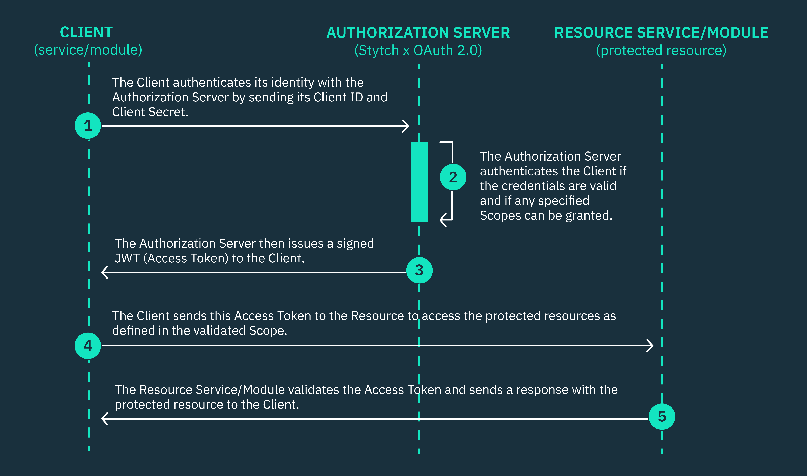

## Machine to Machine communications

Machine-to-machine (M2M) communication is the autonomous exchange of data between machines, devices, or networks without the need for human involvement.

Examples of machine to machine communication can be:
- Service to Service
- CLI client to internal service

The element used to establish trust between these systems is the client. The client can be an application, a process or even
an autonomous system.

## Client Credentials Grant - OAuth 2.0

https://datatracker.ietf.org/doc/html/rfc6749

The clients holds two pieces of information: The client ID and the client secret. With that, the client can request an access token.

```
POST https://<YOUR AUTH0 DOMAIN>/oauth/token

{
  "grant_type": "client_credentials",
  "client_id": "<CLIENT_ID>",
  "client_secret": "<CLIENT_SECRET>",
  "audience": "<API_IDENTIFIER>"
}
```

The OAuth 2.0 Client Credentials grant type is ideal for securing autonomous interactions in machine-to-machine (M2M) applications, such as APIs, backend services, servers, background processes, or command line interfaces (CLIs) that don’t require human users.



1. The Client application must send its Client ID, Client Secret, an array of Scopes, and an endpoint redirect URI in a secure HTTPs POST request to the token endpoint of the OAuth 2.0 Authorization server.
2. The Authorization server verifies the Client’s credentials and determines if the Client is permitted to access the specified Scopes from the Resource server.
3. If the client credentials are valid, the Authorization server will send a response to the endpoint redirect URI containing a cryptographically signed Access Token (JSON Web Token (JWT)).
4. The client now uses this JWT token to gain authorized access to the Resource server based on the specified Scopes, only if the token is valid.


## JSON Web Tokens

JSON Web Token (JWT) provides a mechanism for sharing a set of claims or properties from a client to a microservices application in an encrypted and secure way. JWTs can also secure communication between services or pass end-user context and data between microservices.

For example, you can use a JWT token to pass the ID of the calling microservice, the ID of the client, or the system that initiated the request. You can also store authorization and authentication properties in a JWT token and share them between multiple clients and servers.

## OAuth API Authentication

OAuth 2.0 provides an industry-standard protocol for authorizing users in distributed systems. In the context of microservices, the OAuth 2.0 client credential flow supports secure server-to-server communication between API clients and API servers. The OAuth framework reduces the burden on developers, eliminating the need to build their own authentication mechanism in each microservice.

OpenID Connect (OIDC) extends OAuth to add federated identities, making it possible to set up delegated authorization. Together, these two layers allow developers to build systems that interact with multiple identity providers. With OIDC and OAuth 2.0, it’s also possible to retrieve a user ID by sending an access token to the user information endpoint. The path to this endpoint can be determined using an OIDC lookup.

# M2M API authorization using JWTs in OAuth 2.0

https://datatracker.ietf.org/doc/html/rfc7519

When a client API sends a request to a server API, it includes the JWT that it must have obtained from the OAuth 2.0 authorization server in the authorization header of its API request. The server API then validates the JWT’s signature and uses the specified claims in the JWT’s payload to either authorize or deny the request.

Securing APIs using JWTs is very different from using API keys or traditional service accounts. While service accounts and API keys are easier to set up for static access control, they lack the dynamic authorization and security capabilities of JWTs. This is why JWTs are becoming the most popular choice for protecting APIs in modern architectures.
